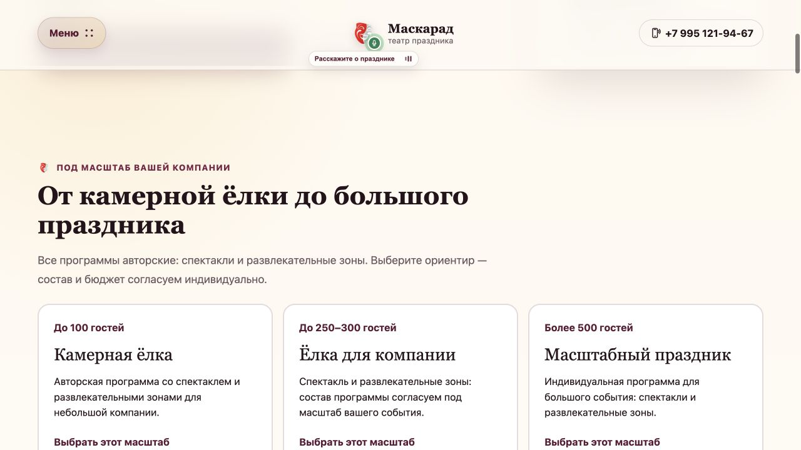

# Корпоративная ёлка: локальная доработка посадочной

9 октября 2026, Москва. Статус: **реализовано и проверено локально, в production не опубликовано**.

## Что изменено

- Первый экран прямо называет корпоративную ёлку для детей сотрудников; основное действие — индивидуальное предложение.
- Интерактивные ориентиры: до 100, до 250–300, более 500 гостей, плюс обсуждение другого/неизвестного масштаба. Это не фиксированные тарифы. Общее число гостей и число детей различаются.
- Состав — авторские спектакли и развлекательные зоны. Бюджет объясняется через масштаб, программу, площадку и дополнения; неподтверждённые цены не добавлены.
- Одна логическая форма рядом с выбором; кнопки первого экрана, расчёта, конца страницы и мобильной панели ведут к ней. Выбранный масштаб сохраняется в существующем message заявки.
- FAQ переписан по фактуре владельца, HTML/JSON-LD совпадают. Существующий URL/canonical сохранены; добавлены ссылки на три новогодних сюжета.
- Для корпоративной формы добавлены `program_select`, `lead_saved`, `lead_error`. Успех вызывается после ответа API об успешном сохранении; в параметрах только категория предложения. Отсутствующая/заблокированная аналитика не мешает заявке.
- Повтор во время отправки блокируется ref, после успеха кнопка отключена до изменения данных. Это клиентская защита; серверная идемпотентность при неопределённом сетевом исходе ещё не реализована.

## Проверка

[Результат контроля](039-corporate-page-verification.json): SEO gate, локальный smoke-test 12/12, один H1/форма, пять FAQ; desktop 1280 и mobile 390 без горизонтальной прокрутки.

Браузер отправил синтетический запрос в отдельный каталог `/tmp/maskarad-corporate-test-leads-20261009`: сохранена одна запись с выбранным средним масштабом, page и согласием. Затем искусственный отказ разрешений хранилища показал запасной способ связи и не создал запись; права восстановлены 0700. Боевые данные не читались и не менялись. Контракт аналитики дополнительно проверен с отсутствующим и выбрасывающим ошибку счётчиком.

## Осталось до рекламного запуска

Корпоративные фото/видео/реальные кейсы с источниками и правами — новые материалы не получены, существующая галерея не объявлена доказательством корпоративного события. Нужны обработчик/статусы продаж, безопасная атрибуция рекламных источников и подтверждение событий в кабинете Метрики. Бюджет теста/доступ к Директу не получены. Шаг 040 остаётся подготовкой/очередью, расход не выполнялся.

Публикация и фактические даты sitemap/обновления — отдельный 039-8; слот 009 12 октября пока сохранён, текущее число опубликованных обновлений остаётся 1/37. Для выпуска сверить маркер и публичную страницу; текущий локальный просмотр: `http://localhost:4310/prazdniki/korporativnyy-novogodniy-prazdnik`.

Связанные итоги: [039-1](../development-steps/completed-steps/039-1-corporate-facts-and-brief.md), [039-2](../development-steps/completed-steps/039-2-individual-corporate-offer.md), [039-3](../development-steps/completed-steps/039-3-corporate-page-local.md). Весь шаг [039](../development-steps/new-steps/039-corporate-new-year-conversion.md) не объявлен завершённым. План воронки — [038](038-winter-conversion-funnel.md).

## Публикация после локальной проверки

9 октября 2026 результат опубликован в [044](044-production-release.md). Предыдущие записи выше описывают состояние на момент локальной проверки; текущий публичный статус и календарь — в 044 и current-steps.
