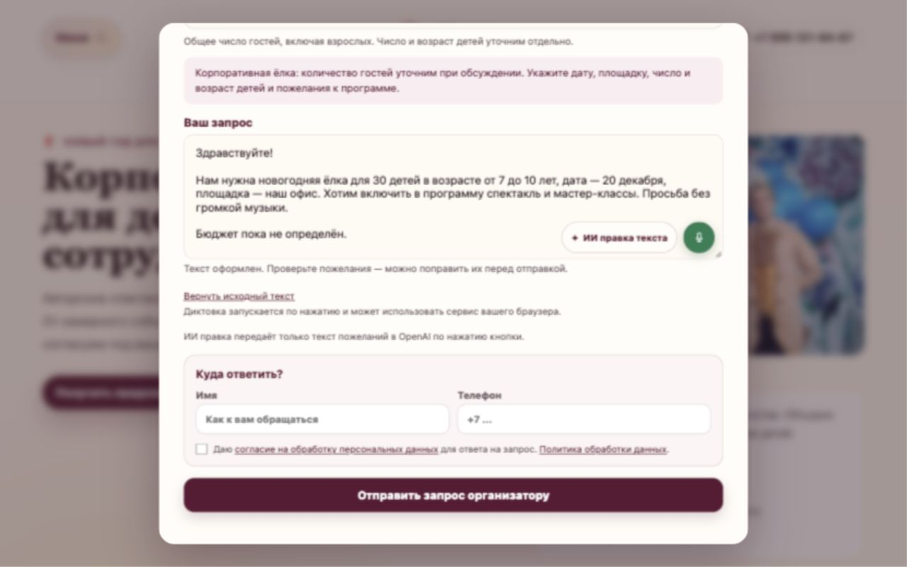
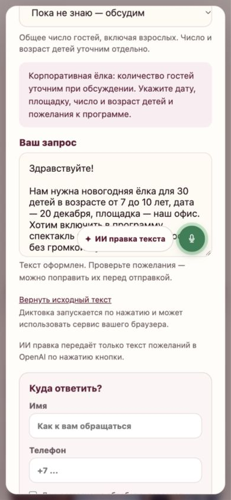

# 053 — ИИ правка пожеланий

2026-10-10. Завершено локально по запросу владельца, [план](../development-steps/new-steps/053-ai-text-edit.md).

## Что изменено

- В существующем попапе рядом с микрофоном добавлена кнопка «ИИ правка текста».
- Пустое поле показывает подсказку: можно написать или наговорить пожелания одним потоком, без структуры.
- Кнопка заменяет пожелания оформленным текстом через прежнее подключение OpenAI; имя и телефон из отдельных полей не входят в запрос.
- Во время обработки виден статус; при ошибке исходник сохраняется, после успеха его можно вернуть отдельной кнопкой.
- Отправка организатору остаётся отдельным действием. Выбор числа гостей и существующая короткая форма сохранены.
- Серверный маршрут ограничивает размер/частоту запроса, проверяет ответ и использует таймаут. Политика сайта описывает передачу текста для правки.

## Проверки

| Плоскость | Доказательство |
|---|---|
| Сборка | `npm run build` прошла, маршрут `/api/text-edit` включён |
| Контент | `npm run seo:faq-coverage`: 122/122 |
| HTTP | [Валидация](053-api-validation.json): пять некорректных запросов получили ожидаемые ответы |
| Обработчик | [Сценарии с подменённым сервисом](053-route-check.json): семь проверок, включая сбой, неполный ответ, отсутствие настроек и лимит частоты |
| Реальная интеграция | [Браузер](053-text-edit-browser.json): OpenAI исправил тестовый текст; факты и ограничения сохранились, возврат оригинала проверен; после восстановления локального процесса итоговая сборка проверена повторно |
| Другие страницы | На `/uslugi` открыт общий попап: поле, «ИИ правка текста» и микрофон присутствуют; вариант с количеством гостей остаётся только для корпоративной страницы |
| Размеры экрана | 390×844 и 1280×800: кнопки не пересекаются, горизонтального переполнения нет |

## Подключение и границы

Использованы существующие `OPENAI_API_KEY`, `OPENAI_BASE_URL`, `OPENAI_BRIEF_MODEL`; модель по умолчанию — прежняя gpt-5. Источник формата запроса: [официальная документация OpenAI](https://developers.openai.com/api/docs/guides/text). Настройки сервера не менялись, значения ключей не записывались и не выводились. Для локального предпросмотра добавлен скрипт `scripts/server/local-openai-preview.cjs`, который загружает только эти настройки в память процесса.

Проверка проводилась с нейтральными вымышленными пожеланиями и пустыми контактами. Заявку организатору не отправляли; диктовку не запускали. Ответ модели может требовать ручной корректировки — интерфейс предлагает проверить текст и вернуть оригинал. Большой ИИ-бриф, чат и PDF из отменённого 008 не восстанавливаются.

Пакет 047–053 остаётся локальным. Публикация на сервер отдельно.
