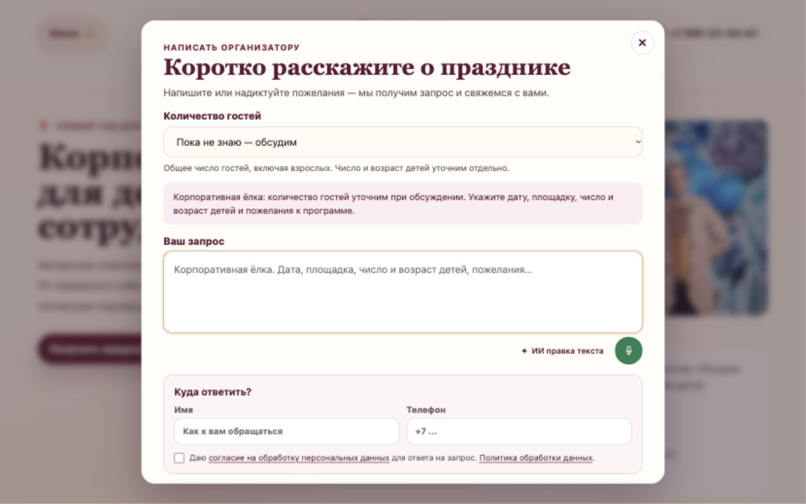
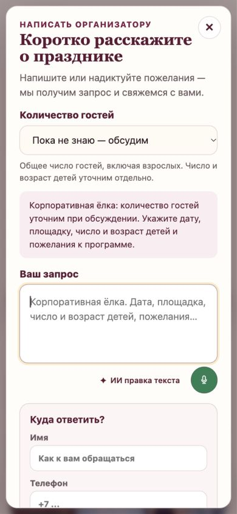

# 054 — Поле пожеланий и лёгкие кнопки

2026-10-10. Завершено локально, [запросы владельца и план](../development-steps/new-steps/054-wish-toolbar-layout.md).

Кнопки ИИ правки и диктовки стоят отдельной строкой под полем, поэтому не перекрывают пожелания. ИИ кнопка стала визуально легче: прозрачный фон, без видимой рамки, менее жирное начертание. Поле начинается с четырёх строк; автоматически растёт и сокращается при изменении текста. Изменение ширины экрана также пересчитывает высоту. Статус диктовки вынесен из текста.

По последнему уточнению владельца удалены обе технические поясняющие строки о сервисе диктовки и передаче текста в OpenAI. Они не показываются в попапе.

## Проверки

- Итоговая `npm run build` прошла, включая TypeScript; `git diff --check` прошёл.
- [Браузерный протокол](054-layout-browser.json): 390×844 и 1280×800, пять состояний пустого/длинного/сокращённого текста. Стартовая высота 130 px; четыре строки по 24 px плюс отступы и рамка. Текст 1133 символа увеличивает поле, удаление сокращает его.
- Текст не обрезан, кнопки всегда ниже textarea; горизонтального переполнения нет. Временные размеры браузера сброшены.

Существующие обработчики ИИ правки, возврата оригинала, диктовки и отправки заявки сохранены. Реальную отправку заявки и микрофон не запускали. Локальная версия обновлена, публикация отдельно.
