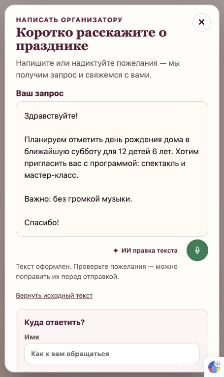
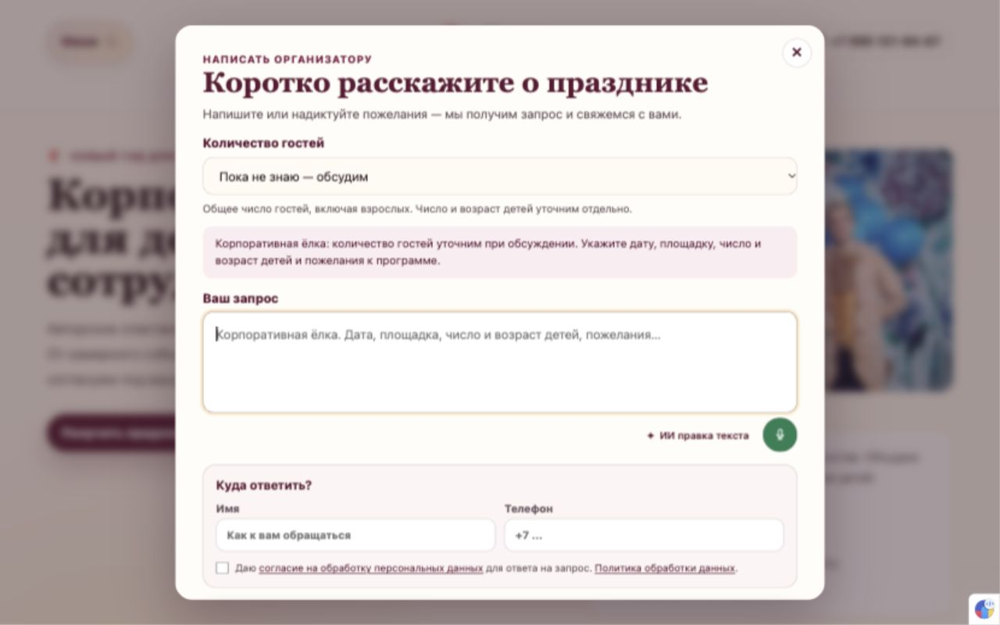

# 055 — Публикация пакета сайта 047–054

2026-10-10. Поручение владельца «пуш на гит и сервак» и повторное «пуш пробуй, надо понять в чем проблема и на сервер заливаем» выполнены.

Коммит приложения: `8c45ffd01c607e255bf740d7658e4ff7e7289963`, [GitHub](https://github.com/roststat/maskarad/commit/8c45ffd01c607e255bf740d7658e4ff7e7289963). Сайт: [maskarad-teatr.ru](https://maskarad-teatr.ru). [Корпоративная ёлка](https://maskarad-teatr.ru/prazdniki/korporativnyy-novogodniy-prazdnik), [услуги](https://maskarad-teatr.ru/uslugi).

## Что опубликовано

Смысловые переходы на общих шаблонах со восстановленными просторными отступами; начало страницы при внутренних переходах; исправленные области клика карточек меню; корпоративный выбор гостей в существующем попапе и точная подпись CTA; общая ИИ правка текста через прежний OpenAI; поле на четыре строки с автоматическим ростом и лёгкие кнопки под текстом. Обе технические поясняющие строки убраны из попапа.

## Причина задержки

Песочница запрещала запись `.git/index.lock`, расширенное разрешение не проходило из-за лимита автоматической проверки. Lock-файла не было, менять права каталога не потребовалось. Повторный `git add` с разрешением успешно записал индекс, затем коммит и push в main прошли.

## Доказательства

- Локальный и серверный seo:predeploy: 163 старых URL / 179 правил, отсутствие цепочек редиректов, alt, TypeScript, сборка 198 страниц, FAQ 122/122.
- GitHub принял `3904bc0..8c45ffd`; серверный HEAD и `.git/maskarad-last-successful-deploy` совпали на `8c45ffd`. systemd `Result=success`, журнал содержит успешный gate и PM2 reload только `maskarad-site`.
- Публичный seo:prelaunch прошёл 12/12.
- [Браузерный протокол](055-public-browser.json): ИИ действительно вернул оформленный текст на `/uslugi`, возврат восстановил оригинал; корпоративный выбор «До 100 гостей» передался в окно, крошка открыла `/prazdniki` с `scrollY=0`. На 390×844 и 1280×800 кнопки ниже поля и горизонтального переполнения нет.

Контакты, микрофон и отправка заявки в проверке не использовались. Ключи и хранилище заявок не менялись. Косметика не увеличивает счётчик содержательных обновлений 009. Завершение зимней стратегии 039/040 и остальные обязательства остаются по прежнему плану.

После проверки отдельным коммитом отправляются только эти результаты и статусы. Код приложения остаётся версией `8c45ffd`; окончательное совпадение серверного HEAD и маркера дополнительно проверяется после синхронизации документации.
