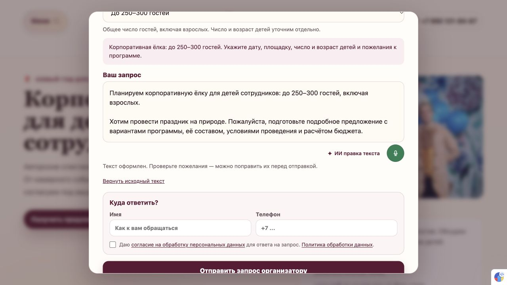

# 056 — исправление ИИ правки и учёт гостей

2026-10-10. Опубликовано и проверено: [корпоративная ёлка](https://maskarad-teatr.ru/prazdniki/korporativnyy-novogodniy-prazdnik). Коммит приложения `10c566ab88f840e6b3186af5643a6be4790681d1`.

Запрос владельца: «ИИ не переписывает текст , давай доработаем этот блок. Чтобы красиво переписывал и когда выбрана строчка с количеством человек учитывал ее».

## Причины

Публичная ошибка воспроизведена: 502 за 10,5 с. Системный DNS сервера возвращал адреса, с которыми соединение не устанавливалось: `UND_ERR_CONNECT_TIMEOUT`. Проверенный альтернативный DNS дал доступные адреса того же сервиса; перебор адресов нужен, потому что доступность различается. Отдельно клиент вообще не отправлял выбранный масштаб в ИИ.

## Решение

Редактор получает выбранное количество как общий масштаб с учётом взрослых; сервер добавляет точное вступление. Сам текст превращается в связное обращение. Короткие исходники дают компактный результат, без придуманных услуг, цен, возрастов и обещаний. Смена гостей обновляет созданное вступление, ручные пожелания сохраняются, повторная правка не дублирует его. Есть возврат исходника.

Соединение имеет ограниченный повтор и резервный DNS, TLS остаётся включённым. Это восстановление доступа к прежнему сервису, настройка подключения и ключи сохранены. После полного отказа исходник остаётся в поле. Для диагностики записываются только безопасные коды и статусы.

## Проверки

См. [056-1](../development-steps/completed-steps/056-1-ai-connection-diagnosis.md) и [056-2](../development-steps/completed-steps/056-2-context-and-editor.md): внешний HTTP, новая обработка в памяти сервера, реальный резервный транспорт, 10/10 API-проверок, сборка/TypeScript/SEO и локальный браузер.

[056-3 — публикация](../development-steps/completed-steps/056-3-publication-and-public-check.md): серверный HEAD/маркер совпали, service Result=success; серверный gate и 10/10 контрактов прошли, внешнее SEO 12/12. [Публичный протокол](056-public-browser.json) подтверждает реальную правку примера владельца, замену выбранного масштаба, точный возврат исходника, отдельные 40 детей 6–10 лет и общий режим на `/uslugi` с сохранением возраста, числа, даты и отрицания.

Официальная справка: [Node — перебор адресов при connect](https://nodejs.org/api/net.html#socketconnectoptions-connectlistener), [OpenAI — неполные ответы и output tokens](https://developers.openai.com/api/docs/guides/reasoning). В данном случае исходный сбой подтверждён как соединение, недостаток токенов не объявляется его причиной.

Без новых заявок, контактов и включения микрофона. Статусы зимней стратегии 039/040 и счётчик содержательных обновлений 009 не меняются.

После проверки публикуются только доказательства и статусы; код приложения остаётся `10c566a`. Внешний сервис остаётся зависимостью: при полном отказе двух попыток исходник сохраняется. Системный DNS, TLS и настройки/ключи подключения не менялись.
