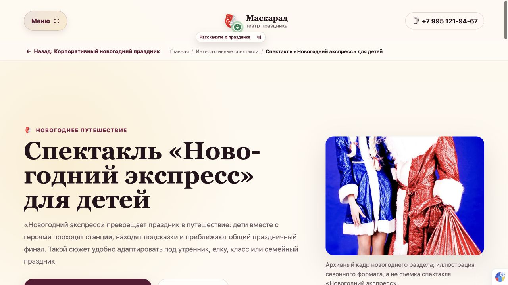

# 057 — Возврат к исходной странице

Визуальная общая строка отменена владельцем в [058](058-centered-breadcrumbs-floating-return.md): крошки снова прежние и по центру, возврат отдельный плавающий. Логика истории и восстановления позиции сохранена. Ниже — исторический итог 057.

## Что изменено

Единая закреплённая строка под шапкой: фактический возврат и структурные хлебные крошки. Применена к главной, каталогам, спектаклям, услугам, праздникам, статьям и галереям — 122 URL. Страницы, открытые напрямую, дают полезный родительский раздел; фактический возврат восстанавливает положение исходной страницы. Отдельная кнопка спектаклей заменена общей.

История хранится в записи браузера, выдерживает обновление и пропускает промежуточные якоря при явном возврате. Обычная навигация меню/логотипа/карточек/крошек сохраняет начало страницы сверху. SEO-разметка, тексты, формы и даты 009 не менялись.

## Проверка

[057-1](../development-steps/completed-steps/057-1-shared-page-return.md): типы, сборка 198 страниц, полный gate, навигация 122/122, существующие fallback-ссылки и BreadcrumbList 121/121.

[057-2](../development-steps/completed-steps/057-2-browser-paths.md): каталоги спектаклей/услуг, корпоративный источник, крошки, галерея, якорь, обновление и верх страницы. Проверен desktop; инструмент изменения viewport не позволил подтвердить мобильный просмотр. Рост конверсии требует дальнейшего измерения.

## Публикация

[057-3](../development-steps/completed-steps/057-3-production-return.md) завершён: приложение `78a698c` опубликовано; серверный HEAD/маркер совпали, Result=success, сборка/FAQ gate и внешний SEO 12/12 прошли. На живом сайте проверены крошки, корпоративный источник, спектакль, якорь и reload; возврат восстановил `scrollY=7120.5`, ошибок в консоли нет.

