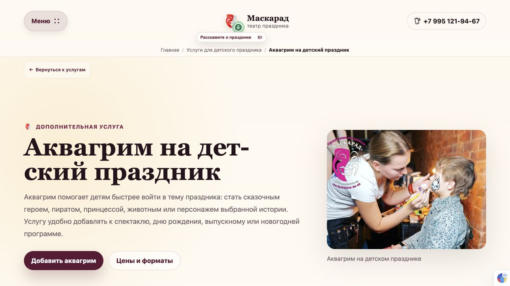

# 058 — Крошки по центру и лёгкий плавающий возврат

По уточнению владельца визуальная строка 057 отменена. Прежние крошки восстановлены и центрированы, возврат вынесен отдельно ниже крошек; шрифт уменьшен до 0.72rem, фон полупрозрачный. При открытом меню возврат скрыт. Путь назад и восстановление места в каталоге сохранены.

[058-1](../development-steps/completed-steps/058-1-breadcrumb-appearance.md): типы, сборка 198 страниц, FAQ 122/122, HTML всех 122 URL.

[058-2](../development-steps/completed-steps/058-2-floating-return-browser.md): desktop, центрирование/размер шрифта, меню, карточки спектаклей и услуг, якорь и восстановление положения списка.

[058-3](../development-steps/completed-steps/058-3-published-floating-return.md) завершён: приложение 92794d1 опубликовано, серверный HEAD/маркер совпали, Result=success, внешний SEO 12/12. Публично подтверждены центрирование, отдельное положение, шрифт 11.52px, полупрозрачный фон и скрытие при открытом меню.

